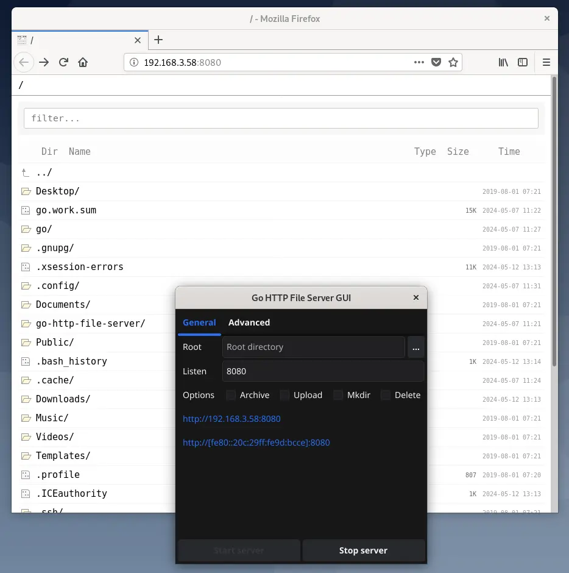

# Go HTTP File Server GUI
A GUI wrapper for go-http-file-server.



## Prerequisites
Setup [Fyne prerequisites](https://docs.fyne.io/started/#prerequisites).

## Run from source
```sh
go run .
```

## Build
```sh
go build .
```

## Build and package
```sh
bash build/build-current.sh
```
