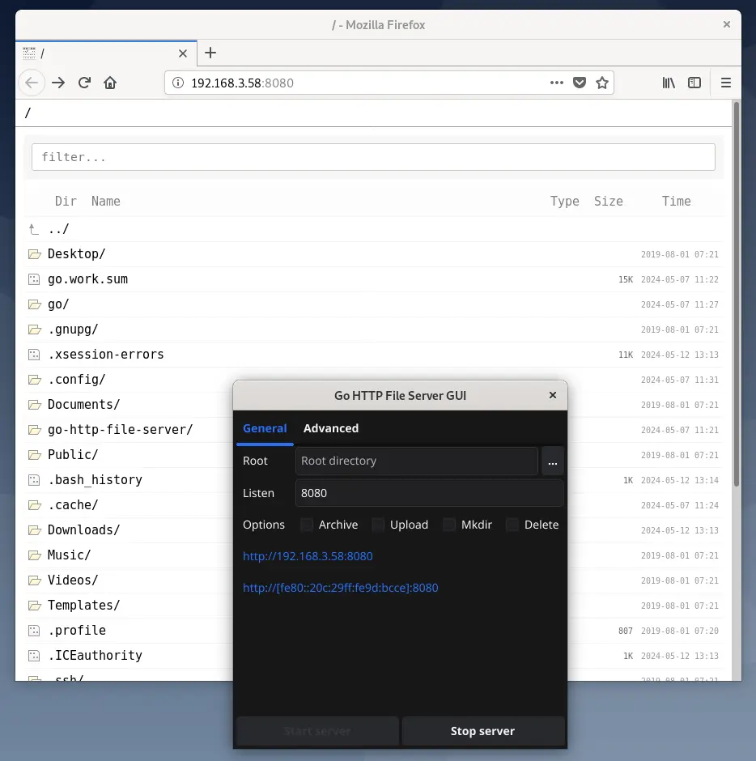

# Go HTTP File Server GUI

go-http-file-server的GUI图形界面版本。



## 先决条件

该GUI使用 [modernc.org/tk9.0](https://pkg.go.dev/modernc.org/tk9.0)，这是CGo-free的，并绑定了Tcl/Tk运行时——无需C工具链或系统Tcl/Tk。
在Linux上，运行时需要X11显示。

## 从源代码运行

```sh
go run .
```

## 编译

```sh
CGO_ENABLED=0 go build .
```

## 编译并打包

```sh
bash build/build-current.sh   # 为当前平台编译单个二进制文件
bash build/build-all.sh       # 交叉编译所有平台的二进制文件到output/
```
